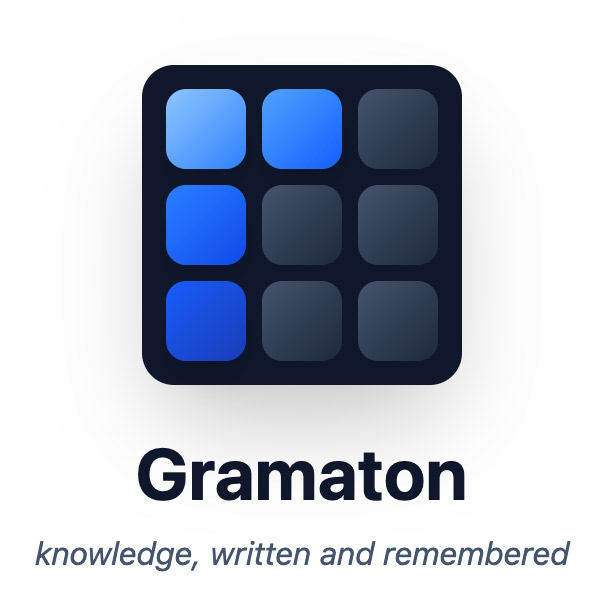

<p align="center">
  
</p>
<p align="center"><b>gram·a·ton</b> <i>/ˈɡramətɒn/</i> — from Greek <i>gramma</i> (writing) + <i>automaton</i> (self-acting). A thing that writes and remembers by itself.</p>

<p align="center">
  <a href="https://go.dev/doc/install"></a>
  <a href="LICENSE"></a>
</p>

**Gramaton is an experimental local, versioned knowledge store for AI agents.** It carries epistemic metadata (confidence, temporality, lifecycle, provenance) on every record and links them in a property graph, so agents can retrieve knowledge with its context — across conversations, tools, and time.

## Why Gramaton

AI tools ship with built-in memory, and the ecosystem has plenty of general-purpose vector stores. Gramaton exists because both shapes of tool struggle with the same set of questions:

- *"What did we decide about X — and has that been superseded?"*
- *"What's still open on project Y?"* (where missing one item is a failure)
- *"How has our thinking on this evolved since March?"*
- *"What was the context around this decision — who, what prompted it, what else relates?"*
- *"What do I know about this domain that might now be stale?"*
- *"Give me everything connected to this idea, two hops out."*

Built-in agent memory tends to be opaque, per-vendor, and hard to audit or export. Generic vector stores treat a superseded decision from two years ago the same as yesterday's, and have no way to keep a task backlog distinct from a pile of design notes. Autocapture systems often collect so aggressively that the signal drowns in noise.

Gramaton's differences:

- **Epistemic metadata on every record.** Confidence, temporality (ephemeral / temporal / durable / immutable), epistemic status (well_established → refuted), knowledge type. A superseded decision is marked historical; it doesn't compete with its replacement in search results. A low-confidence speculation is surfaced with that caveat attached.
- **Three retrieval shapes, not one.** Ranked fuzzy retrieval for knowledge, automatic extraction from conversation, and exhaustive-every-item collections for tasks. The right guarantee for the right question. See [Three Ways to Store Knowledge](#three-ways-to-store-knowledge) below.
- **Versioned by design.** Every mutation is a commit. Branch, diff, log, revert. You can ask *what changed*, not just *what is*.
- **A graph, not a list.** Records are nodes connected by typed, weighted edges. Hybrid search (vector + BM25) ranks candidates, then traversal fans out to related knowledge. Recurring keywords graduate to concept nodes that act as hubs.
- **Local, portable, and MCP-native.** A single Go binary on Linux, macOS, and Windows (amd64 and arm64 where applicable). State lives in a directory on your filesystem — exportable, inspectable, moveable, no cloud dependency. The MCP interface means the same store serves Claude Code, Kiro, custom agents, or anything else that speaks MCP, so your knowledge survives tool changes. See [docs/windows.md](docs/windows.md) for Windows-specific notes.
- **Automatic curation.** The store actively maintains itself — stale records expire, orphans get linked, duplicates get consolidated, concept candidates get detected. With an LLM provider configured, classification and contradiction-detection run too.

What Gramaton isn't:

- **Searchable surface is distilled, not verbatim.** Search retrieves committed Session segments and Memory records — extracted knowledge, not a full chat log. Raw transcripts can be archived alongside a session (compressed, path-addressable on disk); the session state points at the archive so an agent can decompress and read it if something seems missing. Archiving is opt-in at the Gramaton layer — the shipped Claude Code and Kiro hooks under [`hooks/`](hooks/) wire it up automatically at compaction boundaries, and the `gramaton session archive` CLI covers manual or custom workflows. The archive itself isn't indexed for search today.
- **Not a multi-user service.** Current versions are single-user and local. Auth and tenancy are future work.
- **Not a managed RAG solution.** It's infrastructure you run, not a hosted API.

## What this is, and what we don't know yet

Gramaton is an experiment in whether structured metadata around stored data — confidence, temporality, knowledge type, epistemic status, graph relationships, automatic curation — actually helps AI agents remember and retrieve well. The motivating problem is observable: feed an LLM a flat corpus and it treats everything as roughly equally relevant — five years of roadmaps merge into one signal, refuted theories sit alongside live ones, last quarter's decision competes with the one being made today. Lifecycle and confidence don't come from raw text; they have to be attached at the data layer. The hypothesis comes from three research traditions covered in [foundations.md](docs/project-design/foundations.md): epistemology (knowledge ≠ text), neuroscience (episodic vs semantic, fast save vs slow consolidation), and technical knowledge representation (property graphs, emergence over declaration).

The infrastructure works. Agents can save, retrieve, traverse, branch, supersede. Curation runs in the background and integrates new knowledge over time. The mechanics line up with the research.

What's open is **whether agents consistently use the structure well**. Getting Claude Code (and presumably other MCP-aware harnesses) to recognize the right tool, save at the right granularity, search before answering, and apply metadata thoughtfully is uneven in practice. We don't yet know whether the gap is in harness integration (more hooks, better routing rules), in onboarding (clearer guidance, better defaults), or in the design itself (the metadata model may not be pulling enough weight to justify its surface area).

Real-world usage is the only way to find out. If you try Gramaton and it works for you, that's signal. If you try it and it falls short, please [open an issue](https://github.com/gramaton-ai/gramaton/issues) and tell us what you expected and what happened — that's louder signal. Gramaton is a hypothesis to test, not a product to defend.

## Quick Start

**Requires:** Go 1.26+ — see [go.dev/doc/install](https://go.dev/doc/install).

```bash
# Install
go install github.com/gramaton-ai/gramaton@latest

# Launch the interactive setup wizard.
gramaton init
```

The wizard (when run in a terminal) walks five numbered steps plus a verification wrap-up:

1. **Knowledge store** — choose an embedding provider. BERT is the default (pure-Go, local, no API cost) and downloads the 130MB model on first use. Ollama, OpenAI-compatible, and AWS Bedrock are also available, as is `skip` for memory-only / air-gapped setups.
2. **Autonomous curation** — optionally configure an LLM provider for curation, reranking, and session extraction. Anthropic (Claude Haiku default), OpenAI-compatible, and AWS Bedrock are supported; skipping is fine — Gramaton runs with a deterministic-only curator otherwise.
3. **Connecting to your AI tools** — auto-detects `claude` and `kiro` CLIs and registers the `gramaton` MCP entry in each.
4. **Agent usage instructions** — offers to install Gramaton's CLAUDE.md / kiro instructions into each detected client so the agent knows how to use the store. Per-client opt-in.
5. **Automatic knowledge save** — installs Gramaton's session-save hook scripts into your Claude Code / kiro-cli configs (pre-compact, post-compact, session-start, stop).

After Step 5, the wizard runs a verification pass: writes `~/.gramaton/config.yaml`, probes perms + writability, and summarizes what's configured.

The whole flow is idempotent: re-running won't double-register MCP entries or clobber existing hooks. Pass `--non-interactive` to run the legacy scripted path that defaults everything without prompting (useful for CI or automated provisioning).

No external runtime to install. Gramaton ships a pure-Go BERT embedder as the default, so a fresh install is just the Go binary plus a model download on first run.

Prefer a manual setup? The wizard emits exactly what you'd write by hand — drop a `~/.gramaton/config.yaml` and add Gramaton to your MCP client:

```json
{
  "mcpServers": {
    "gramaton": {
      "command": "gramaton",
      "args": ["mcp"]
    }
  }
}
```

Your agent now has access to the full Gramaton MCP toolset — save and search for semantic knowledge, session extraction for automatic save, collections for structured items, and versioning tools for history. See [MCP Tools](#mcp-tools) below.

A CLI mirrors the MCP surface for inspection, scripting, and debugging.

## Who This Is For

Gramaton is for anyone who works with AI tools and wants them to remember things properly.

A researcher tracking findings across hundreds of papers. A project manager whose AI assistant should know what was decided last quarter and why. A developer whose coding agent keeps forgetting architecture decisions. A writer building a novel with an AI collaborator that needs to keep characters and plot points straight. Anyone who has ever wished their AI tools had a better memory they could actually control.

## Three Ways to Store Knowledge

Gramaton isn't one bucket of retrieved-by-similarity notes. It offers three distinct storage paths with different retrieval guarantees. Matching the path to the question is the most important integration decision.

### Memory — fuzzy, semantic, ranked

For knowledge that benefits from best-match retrieval. Decisions, design rationale, research findings, user preferences, domain context.

Memory records land from several paths: explicit `gramaton_save` calls, the `gramaton_intake` write endpoint (with optional LLM-side classification), session commits that promote segments to Memory (the default — see Sessions below), and bulk ingest via the `gramaton ingest` CLI. All paths produce records with the same shape and the same retrieval semantics.

Retrieval is via `gramaton_search`: results are ranked by composite score combining vector similarity, BM25 keywords, freshness (decayed by temporality), access-based activation, and confidence. A low-relevance miss is acceptable; the goal is surfacing the best few results, not all of them.

### Sessions — automatic extraction from conversations

For knowledge that emerges during conversation without the agent being asked. Two-phase: `gramaton_session_prepare` returns extraction instructions; `gramaton_session_save` submits the extracted segments. Each segment becomes a Session record (BM25-indexed, preserves the conversational thread) and, by default, a linked Memory record (vector-embedded for semantic search). Exploration, open questions, and dead ends can stay Session-only with `promote_to_memory: false` — searchable without polluting Memory's vector space.

### Collections — structured, exhaustive

For things where missing one item is a failure: tasks, TODOs, action items, checklists, sprint backlogs, reading lists. Collections are named containers with optional schemas that enforce field types. `gramaton_collection_items` returns every item — no ranking, no top-N cutoff, no relevance tradeoff. Items are also graph nodes and can be linked to knowledge records.

### Decision rule

> *Will missing one item be a failure?*
> **Yes** → Collection. **No** → Memory (direct save, or via session extraction).

The [Integrator Guide](docs/integrator-guide.md) has the full treatment.

## How It Works

Records are nodes in a property graph. Each carries typed properties and metadata: confidence, temporality, epistemic status, knowledge type, provenance, timestamps. Relationships are typed, weighted edges. Every mutation is a versioned commit with full history.

Search combines vector similarity and BM25 keywords fused via Reciprocal Rank Fusion, then scores results with a composite model (similarity, freshness, activation, confidence). Metadata filters narrow candidates *before* ranking — a superseded decision doesn't get to compete with its replacement. Graph traversal from top results surfaces related knowledge the query text didn't directly mention.

Background curation runs on a timer inside the server:

- **Always on:** lifecycle transitions (expire stale ephemeral/temporal records), orphan linking, duplicate consolidation, concept candidate detection, enrichment of existing concept nodes.
- **With an LLM provider configured:** classify pending records, generate missing summaries, detect semantic contradictions between similar records, synthesize a qualitative store manifest.

```
   Agent
     │
     │  MCP  /  HTTP  /  CLI
     ▼
┌────────────────────────┐
│  Server transports     │   bindings + MCP handlers + curation runner
└───────────┬────────────┘
            │
┌───────────┴────────────┐
│   api (canonical ops)  │   one definition per operation; locking discipline
└───────────┬────────────┘
            │
┌───────────┴────────────┐
│ Engine (composition)   │   graph + indexes + embedder + LLM
└───────────┬────────────┘
            │
  ┌─────────┼─────────┐
  ▼         ▼         ▼
┌─────┐  ┌──────────┐  ┌────────┐
│Graph│  │ Indexes  │  │Storage │
│     │  │ BM25     │  │ prolly │
│     │  │ HNSW/Flat│  │ tree   │
│     │  │ Property │  │        │
└─────┘  └──────────┘  └────────┘
```

For the full layered package map, lock discipline, and data flow, see [Architecture](docs/architecture.md).

## Features

- **Epistemic metadata** — confidence, temporality, knowledge type, epistemic status, importance on every record
- **Hybrid search** — vector similarity (HNSW at scale, flat at small candidate sets) + BM25 keyword search, fused with RRF
- **Versioned graph** — branch, diff, merge, revert. Full commit history. Auditable.
- **Three storage paths** — Memory (fuzzy), Sessions (auto-extract), Collections (exhaustive)
- **Concept detection and promotion** — recurring keywords are detected as concept candidates; with an LLM provider configured, candidates are promoted to concept nodes that link related knowledge across topics
- **Automatic curation** — lifecycle management, orphan linking, dedup, concept candidate detection, optional LLM classification and contradiction detection
- **Auto-supersession** — saves that closely match an existing record (≥0.92 cosine) automatically mark the older record historical and create a `supersedes` edge. Scoped per-collection via three orthogonal knobs (`curation`, `supersession`, `contradictions`); see `gramaton_guide(topic="collections")` for the per-template defaults.
- **Named stores** — run multiple isolated knowledge bases from the same binary (personal store, benchmark store, per-project store)
- **Multiple providers** — pure-Go BERT (local, default, no external runtime), Ollama (local, alternative), OpenAI-compatible, and AWS Bedrock for embeddings; Anthropic, OpenAI-compatible, and AWS Bedrock for LLM

## MCP Tools

Gramaton's primary interface is MCP, organized into clusters matched to the three storage paths plus versioning and admin. For live descriptions and schemas, call `gramaton_guide(topic=...)` from any MCP-aware agent.

### Records (Memory)

| Tool | What it does |
|------|-------------|
| `gramaton_save` | Store a knowledge record with epistemic metadata |
| `gramaton_save_batch` | Submit many records in one call. Sync mode returns per-item results inline (failures land in a `failed[]` array; the batch keeps going). Async mode returns a job id with `_status`, `_result`, `_cancel` companions for polling |
| `gramaton_inspect` | Full content, metadata, and one-hop related edges for a record |
| `gramaton_update` | Modify properties on an existing record |
| `gramaton_classify` | Assign or update classification metadata on a pending record |
| `gramaton_resolve` | Mark a record as resolved (completed / superseded / abandoned / obsolete) |
| `gramaton_intake` | Submit pre-extracted facts for deferred curation |
| `gramaton_link` / `gramaton_unlink` | Manage typed, weighted edges between records |
| `gramaton_history` | Per-record change history |

### Search & discovery

| Tool | What it does |
|------|-------------|
| `gramaton_search` | Hybrid vector + keyword search with metadata filtering |
| `gramaton_explore` | Graph traversal from a node with edge-type and weight filters |
| `gramaton_pending` | List records awaiting classification |
| `gramaton_duplicates` | Find near-duplicate records by vector similarity |
| `gramaton_stats` | Aggregate statistics over the store |
| `gramaton_status` | Server health, curation state, embedding coverage |

### Sessions (automatic extraction)

| Tool | What it does |
|------|-------------|
| `gramaton_session_start` | Begin a conversation session bound to a client |
| `gramaton_session_get` | Fetch current session state (segments committed so far) |
| `gramaton_session_prepare` | Get extraction instructions; must be called before commit |
| `gramaton_session_save` | Submit extracted knowledge segments — creates Session records and (by default) linked Memory records |

### Collections (structured, exhaustive)

Twelve `gramaton_collection_*` tools cover the full lifecycle: `create`, `list`, `items`, `add`, `add_batch`, `update`, `move`, `remove`, `rename`, `delete`, `schema`, `migrate`. Collections support optional schemas with typed, required fields; items are graph nodes and can be linked to knowledge records. See the [Integrator Guide](docs/integrator-guide.md) for the full tool reference.

### History & admin

| Tool | What it does |
|------|-------------|
| `gramaton_log` | Commit log or per-record change log |
| `gramaton_diff` | Structural diff between two commits or branches |
| `gramaton_branch` | Create / list / checkout / merge / discard branches |
| `gramaton_backup` | Create a backup archive of the store |
| `gramaton_curation` | View curation status, trigger a sweep, or dry-run |
| `gramaton_reembed` | Re-embed records after an embedding model change |
| `gramaton_jobs_list` | List active async jobs (save batches and future async ops) |
| `gramaton_guide` | Live topic-addressable reference (save, search, sessions, collections, metadata, curation, temporal-queries) |

Gramaton also ships prompt templates and agent instructions for [Claude Code](integration/claude-code/) and [custom agent frameworks](integration/docs/custom-agents.md).

<details>
<summary><strong>CLI Reference</strong></summary>

A CLI mirrors the MCP surface for inspection, debugging, and scripting. A curated subset:

| Command | Description |
|---------|-------------|
| `gramaton init [--force]` | Interactive setup wizard (embed provider, LLM, MCP clients, agent-usage instructions, hooks, verify). `--force` re-runs the wizard on an existing install (preserves API keys). `--non-interactive` runs the scripted defaults path. |
| `gramaton preflight` | Verify daemon health, embedding model, LLM connectivity, and config sanity. Exits non-zero on blocking issues. |
| `gramaton serve` | Run the server in the foreground (otherwise auto-started on first use) |
| `gramaton status` | Server and store health |
| `gramaton store <subcmd>` | Manage named stores (create, list, delete) |
| `gramaton search <query> [flags]` | Search with metadata filtering |
| `gramaton inspect <id>` | Full record details |
| `gramaton explore <id> [--depth N]` | Graph traversal |
| `gramaton save` | Store a record (JSON on stdin) |
| `gramaton classify <id>` | Classify a pending record |
| `gramaton resolve <id>` | Mark as resolved |
| `gramaton update <id>` | Modify properties or edges |
| `gramaton delete <id> --reason "..."` | Soft delete |
| `gramaton session <subcmd>` | Session management |
| `gramaton ingest <files>` | Bulk-load text files |
| `gramaton log [--last N]` | Commit history |
| `gramaton diff [ref1..ref2]` | Structural diff |
| `gramaton history <id>` | Per-record change history |
| `gramaton branch <subcmd>` | Branch management |
| `gramaton revert <commit>` | Rollback to a prior commit |
| `gramaton export` / `gramaton import` | Export and import records |
| `gramaton reembed [--batch N]` | Re-embed after model change |
| `gramaton repair [--content-quality]` | Operator-driven self-heal (e.g. backfill missing summaries) |
| `gramaton mcp` | Run as an MCP stdio proxy to the HTTP server |
| `gramaton hook <event>` | Internal: agent-lifecycle hook dispatcher invoked by hook scripts |

Run `gramaton <command> --help` for flags.

</details>

<details>
<summary><strong>Configuration</strong></summary>

Config lives at `~/.gramaton/config.yaml`. All fields have sensible defaults — an empty or missing config file is valid. Embedding defaults to pure-Go BERT (`bge-small-en-v1.5`); you only need an `embedding:` block if you want a different provider or model.

```yaml
# Optional -- enables autonomous curation.
llm:
  provider: anthropic
  api_key_env: ANTHROPIC_API_KEY

# Optional -- override the default embedding provider.
# embedding:
#   provider: ollama
#   model: mxbai-embed-large
```

Embedding providers: pure-Go BERT (local, default), Ollama (local), OpenAI-compatible, AWS Bedrock.
LLM providers (for autonomous curation): Anthropic, OpenAI-compatible, AWS Bedrock.

Per-store config can override the global config by placing a `config.yaml` inside the store directory.

See [docs/configuration.md](docs/configuration.md) for all fields and [docs/providers.md](docs/providers.md) for provider setup.

</details>

## Documentation

| | |
|---|---|
| [How to use Gramaton](HOW_TO_USE_GRAMATON.md) | Practical tips for driving Gramaton through Claude or another agent — what to say, what to expect, common pitfalls |
| [Integrator Guide](docs/integrator-guide.md) | How to build agents and tools on Gramaton — the three storage paths, retrieval patterns, tool reference |
| [Architecture](docs/architecture.md) | Package layers, data flow, concurrency model, lock discipline |
| [Configuration](docs/configuration.md) | All config fields, defaults, examples, named-store model |
| [Providers](docs/providers.md) | Embedding and LLM provider setup |
| [Benchmarks](docs/benchmarks.md) | Benchmark store setup (LongMemEval and similar) |
| [Tenets](docs/tenets.md) | Design principles |
| [Project Design](docs/project-design/) | Data model, retrieval, collections, threat model, research foundations, design decisions |
| [Contributing](CONTRIBUTING.md) | Conventions for contributors — the operation recipe, lock discipline, tests, CHANGELOG etiquette |
| [Windows](docs/windows.md) | Windows-specific notes — install, supported features, current limitations |

## Community

- [Code of Conduct](CODE_OF_CONDUCT.md) — Contributor Covenant v2.1.
- [Security](SECURITY.md) — vulnerability disclosure process. Do not file public issues for security bugs.

## Acknowledgments

Gramaton draws from many projects in this space, with special
acknowledgment to:

- **[Dolt](https://github.com/dolthub/dolt)** — git-for-data: a SQL
  database with branches, commits, diff, and merge. Gramaton's
  versioned storage follows the same philosophy at smaller scale.

- **[Beads](https://github.com/gastownhall/beads)** — a graph issue
  tracker for AI agents, built on Dolt. The agent-as-primary-user
  framing, typed graph edges, and persistent-memory primitives all
  echo through Gramaton's design.

We're excited by the continuing evolution of AI memory across
projects and ideas.

## License

[Apache 2.0](LICENSE)
